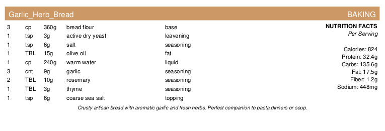
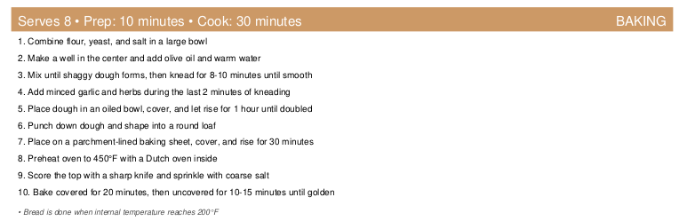

# 🍳 Recipe Binder

**AI-Powered Recipe Cards for Professional Kitchens**

Transform your markdown recipes into beautiful, print-ready cards using OpenAI and intelligent build automation.

## 🤯 Why AI-Powered Recipes?

**The "WHY" hits you when you realize the power:**

- 📝 **Write Once**: Simple markdown recipe → OpenAI creates structured data with weights & USDA nutrition
- 🔄 **Endless Variations**: Ask any AI to "scale this to 12 servings" or "make it vegan" - instant YAML updates  
- ⚖️ **Professional Precision**: Auto-converts volumes to weights (1 cup flour = 120g) for scale-based cooking
- 🧮 **Smart Calculations**: OpenAI knows ingredient densities, USDA provides accurate nutritional data
- 🎨 **Perfect Cards**: Structured data → beautiful, consistent PDF cards with nutrition facts every time

**From "random recipe blog post" to "professional kitchen-ready card" in seconds, with infinite AI-powered customization.**

### 📋 See the Results

**Professional recipe cards with precise weights and nutrition facts:**

| Front Side (Ingredients & Nutrition) | Back Side (Instructions) |
|:---:|:---:|
|  |  |

*Example: Garlic Herb Bread with auto-calculated weights (grams) and USDA nutrition data*

[](https://www.python.org/downloads/)
[](https://opensource.org/licenses/MIT)
[](https://github.com/astral-sh/ruff)
[](https://mypy-lang.org/)
[](https://github.com/yourusername/recipe-binder/actions)

---

## ✨ Features

🤖 **AI-Powered Pipeline**: Automatically parse markdown recipes into structured YAML using OpenAI
🎨 **Professional Card Design**: Generate 8.5"×4" landscape, two-sided recipe cards optimized for professional kitchens
🥗 **Nutrition Facts**: Automatic nutrition calculation using USDA FoodData Central API with 350,000+ food items
🔄 **Smart Build System**: Timestamp-based staleness detection - only rebuild what's changed
📐 **Template-Driven Layout**: Fully customizable card designs via YAML configuration
🎯 **Category Color Coding**: Visual organization with predefined color schemes for different recipe types
🛠️ **Developer-Friendly**: Type hints, comprehensive logging, full test coverage, and makefile automation

## 🚀 Quick Start

```bash
# Clone and setup
git clone https://github.com/yourusername/recipe-binder.git
cd recipe-binder
make install

# Set up API keys (required for AI parsing and nutrition)
export OPENAI_API_KEY="your-openai-api-key"
export USDA_API_KEY="your-usda-api-key"  # Get free key: https://fdc.nal.usda.gov/api-key-signup

# Generate demo cards
make demo

# View your first recipe card
open recipe/pdf/Breakfast-sample-pancakes.pdf
```

## 📋 Pipeline Architecture

Recipe Binder uses an intelligent 3-stage pipeline that automatically maintains your recipe collection:

```
┌─────────────────┐    ┌──────────────────┐    ┌─────────────────┐
│   Markdown      │───▶│      YAML        │───▶│       PDF       │
│   Source        │    │   Structured     │    │   Print-Ready   │
│   Recipes       │    │     Data         │    │     Cards       │
└─────────────────┘    └──────────────────┘    └─────────────────┘
      Human               OpenAI Parsing         Template Engine
     Authored                + Schema              + ReportLab
```

### Smart Build Process
- **Staleness Detection**: Only processes files that are newer than their outputs
- **Error Recovery**: Graceful handling of OpenAI API issues with retry logic
- **Incremental Builds**: Process only what's changed, skip what's current
- **Clean Builds**: `make clean` removes all generated PDFs for fresh starts

## 🏗️ Project Structure

```
recipe-binder/
├── recipe/                 # Recipe data pipeline
│   ├── markdown/          # 📝 Source recipe files (.md)
│   ├── yaml/             # 🔄 Parsed structured data (.yaml)
│   ├── pdf/              # 📄 Generated recipe cards (.pdf)
│   ├── templates/        # 🎨 Card layout definitions (.yaml)
│   └── config/           # ⚙️  Global settings (.yaml)
├── src/recipe_fmt/        # Core Python package
│   ├── pipeline.py       # 🚀 Main orchestrator
│   ├── parsers/          # 🤖 Markdown → YAML conversion
│   ├── generators/       # 📄 YAML → PDF card generation
│   └── utils/            # 🔧 File utilities and helpers
├── tests/                # ✅ Comprehensive test suite
├── Makefile              # 🛠️  Build automation
└── pyproject.toml        # 📦 Python package configuration
```

## 🎨 Recipe Card Design

Professional-grade recipe cards designed for commercial kitchen use:

## Recipe Card Template Specifications
- **Size:** 8.5" × 4" landscape, two-sided
- **Margins:** 0.3" left/right, 0.15" top/bottom
- **Fonts:** Helvetica/Arial family
  - Title: 14-16pt bold white text
  - Category: 11-12pt bold white text  
  - Body: 11pt black text
  - Instructions: 12pt title, 11pt list

## Layout Rules
- **Front Page:** Header banner (0.4" tall) + Ingredient table
- **Back Page:** Instructions (forced page break after ingredient table)
- **Header Banner:** Category (right-aligned) + Title (center) with category color background
- **Ingredient Table:** 3 columns (Ingredient | Amount | Purpose) with dynamic column widths
- **Color Coding:** Use category colors from specification

## File Naming and Categories
- **PDF Files:** Automatically prefixed with category (e.g., `Breakfast-perfect-pancakes.pdf`)
- **Category Detection:** Always automatically inferred from recipe content by OpenAI
- **Category Override:** Edit the generated YAML file directly to change categories if needed

### Category Colors
Each category uses a distinct background color with bold white text for the header banner:

| Category    | Icon | Color        | Hex Code  | Sample Header |
|-------------|------|--------------|-----------|---------------|
| Meat        | 🥩   | Deep Red     | `#CC3333` | <div style="background-color: #CC3333; color: white; padding: 4px 8px; font-weight: bold; display: inline-block;">🥩 MEAT - Perfect Grilled Steak</div> |
| Side        | 🥗   | Teal         | `#009999` | <div style="background-color: #009999; color: white; padding: 4px 8px; font-weight: bold; display: inline-block;">🥗 SIDE - Roasted Vegetables</div> |
| Main        | 🍽️   | Royal Blue   | `#3366CC` | <div style="background-color: #3366CC; color: white; padding: 4px 8px; font-weight: bold; display: inline-block;">🍽️ MAIN - Chicken Parmesan</div> |
| Soup        | 🍲   | Burnt Orange | `#E66600` | <div style="background-color: #E66600; color: white; padding: 4px 8px; font-weight: bold; display: inline-block;">🍲 SOUP - Tomato Basil Soup</div> |
| Sauce       | 🍯   | Indigo Purple| `#663399` | <div style="background-color: #663399; color: white; padding: 4px 8px; font-weight: bold; display: inline-block;">🍯 SAUCE - Hollandaise Sauce</div> |
| Breakfast   | 🥞   | Amber/Gold   | `#D98C00` | <div style="background-color: #D98C00; color: white; padding: 4px 8px; font-weight: bold; display: inline-block;">🥞 BREAKFAST - Perfect Pancakes</div> |
| Salad       | 🥬   | Leaf Green   | `#009933` | <div style="background-color: #009933; color: white; padding: 4px 8px; font-weight: bold; display: inline-block;">🥬 SALAD - Caesar Salad</div> |
| Baking      | 🍞   | Chocolate Brown | `#734019` | <div style="background-color: #734019; color: white; padding: 4px 8px; font-weight: bold; display: inline-block;">🍞 BAKING - Sourdough Bread</div> |
| Dessert     | 🍰   | Raspberry    | `#B33366` | <div style="background-color: #B33366; color: white; padding: 4px 8px; font-weight: bold; display: inline-block;">🍰 DESSERT - Chocolate Cake</div> |
| Other       | 📝   | Dark Gray    | `#4D4D4D` | <div style="background-color: #4D4D4D; color: white; padding: 4px 8px; font-weight: bold; display: inline-block;">📝 OTHER - Special Recipe</div> |


## 🥗 Nutrition Feature

Automatically calculate and display nutrition facts on recipe cards using the USDA FoodData Central API:

### Features
- **6 Key Nutrients**: Calories, Protein, Carbohydrates, Fat, Fiber, and Sodium per serving
- **USDA Database**: Access to comprehensive nutritional data for 350,000+ food items
- **Automatic Enhancement**: Add nutrition data to existing recipes with one command
- **Smart Layout**: Nutrition facts displayed alongside ingredients on front page

### USDA API Key Setup
**Required**: The nutrition feature requires a free USDA API key.

1. **Get Your Free API Key**: Visit [https://fdc.nal.usda.gov/api-key-signup](https://fdc.nal.usda.gov/api-key-signup)
2. **Set Environment Variable**:
   ```bash
   export USDA_API_KEY="your-usda-api-key-here"
   ```
3. **Add to your shell profile** (`.bashrc`, `.zshrc`, etc.) for persistence:
   ```bash
   echo 'export USDA_API_KEY="your-usda-api-key-here"' >> ~/.bashrc
   ```

### Usage
```bash
# Add nutrition to a single recipe
python -m recipe_fmt.nutrition recipe/yaml/pancakes.yaml

# Add nutrition to all recipes
python -m recipe_fmt.nutrition recipe/yaml/*.yaml

# Preview nutrition without modifying files
python -m recipe_fmt.nutrition --dry-run recipe/yaml/pancakes.yaml
```

### Example Output
The nutrition feature adds a clean nutrition facts section to your recipe cards:
```
                    NUTRITION FACTS
                      Per Serving
                    
                    Calories: 824
                    Protein: 32g
                    Carbs: 136g
                    Fat: 18g
                    Fiber: 1g
                    Sodium: 448mg
```

**Note**: Without a USDA API key, sample nutrition data will be displayed for demonstration purposes.

## 🤖 OpenAI Integration

Intelligent parsing of natural language recipes into structured data:

### Features
- **Schema Validation**: Ensures consistent YAML output format
- **Error Handling**: Robust retry logic with exponential backoff
- **Cost Optimization**: Caches successful parses to avoid reprocessing
- **Fallback Support**: Manual YAML editing when AI parsing needs refinement

## 🚀 AI-Powered Recipe Flexibility

**The separated amount/unit schema unlocks incredible AI-powered recipe modification capabilities:**

### 🔄 Unit Conversion Made Easy
```bash
# Use ChatGPT/Claude to convert any recipe:
"Convert this pancake recipe to metric units"
"Change all measurements to weight-based (grams/ounces)"
"Convert Imperial to metric for European baking"
```

### 📏 Recipe Scaling & Substitution  
```bash
# AI can intelligently modify your YAML:
"Scale this recipe from 4 servings to 8 servings"
"Change 2 lbs carrots to 1.5 lbs and adjust other vegetables proportionally"  
"Convert this recipe for a smaller 6-inch cake pan"
"Substitute honey for sugar and adjust liquid accordingly"
```

### 🧮 Smart Modifications
- **Dietary Adaptations**: "Make this recipe vegan" or "Convert to gluten-free"
- **Precision Scaling**: Perfect ratios maintained when scaling up/down
- **Ingredient Swaps**: "Replace butter with olive oil" with automatic adjustments
- **Nutritional Optimization**: "Reduce sodium by 25%" with balanced replacements

**The Power**: Edit your generated YAML with any AI assistant for instant recipe modifications while maintaining the structured format for perfect PDF generation!

### 📐 Standardized Units & Weight Conversion
- **Tablespoons**: Always use `"TBL"` (not tbsp, tablespoon, etc.)
- **Teaspoons**: Always use `"tsp"` (not teaspoon, t, etc.)
- **Weight Display**: Option to show weights alongside measurements: `"2 cups (240g)"`
- **Professional Weighing**: Enable scale-based cooking without volume measurements
- **Consistency**: Ensures clean, professional PDF formatting

### ⚖️ Weight Conversion Feature
**Default ON** - Automatically converts volume/count measurements to grams:
- OpenAI generates `weight_grams` field during markdown→YAML conversion
- PDF displays: `"2 cups (240g)"` or weight-only mode: `"240g flour"`
- Enables professional kitchen workflows with digital scales
- Supports both volume + weight or weight-only display modes

### Example Transformation

**Markdown Input:**
```markdown
# Perfect Pancakes

A family favorite for weekend mornings.

## Ingredients
- 2 cups flour
- 2 tbsp sugar
- 2 tsp baking powder
- 1 cup milk
- 2 eggs, beaten

## Instructions
1. Mix dry ingredients in large bowl
2. Combine wet ingredients separately
3. Fold wet into dry until just combined
4. Cook on 375°F griddle until golden
```

**Generated YAML (automatically inferred category):**
```yaml
title: "Perfect Pancakes"
category: "Breakfast"  # ← Automatically detected by OpenAI
description: "A family favorite for weekend mornings"
servings: 4
prep_time: "10 minutes"
cook_time: "15 minutes"

ingredients:
  - ingredient: "all-purpose flour"
    amount: 2
    unit: "cups"
    weight_grams: 240  # Automatic conversion for weighing option
    purpose: "base"
  - ingredient: "granulated sugar"
    amount: 2
    unit: "TBL"
    weight_grams: 24
    purpose: "sweetener"
  - ingredient: "baking powder"
    amount: 2
    unit: "tsp"
    weight_grams: 8
    purpose: "leavening"
  - ingredient: "whole milk"
    amount: 1
    unit: "cup"
    weight_grams: 244
    purpose: "liquid"
  - ingredient: "large eggs"
    amount: 2
    unit: "whole"
    weight_grams: 100
    purpose: "binding"

# Automatically calculated nutrition (via USDA API)
nutrition:
  per_serving:
    calories: 824
    protein_g: 32
    carbs_g: 136
    fat_g: 18
    fiber_g: 1
    sodium_mg: 448

instructions:
  - "Mix dry ingredients in large bowl"
  - "Combine wet ingredients separately"  
  - "Fold wet into dry until just combined"
  - "Cook on 375°F griddle until golden"
```

## 🛠️ Development

Built with modern Python best practices and comprehensive tooling:

### Technology Stack
- **Python 3.13+**: Latest language features and performance improvements
- **OpenAI API**: GPT-powered recipe parsing and structuring
- **ReportLab**: Professional PDF generation with precise layout control
- **Pydantic**: Runtime type validation and settings management
- **Click**: Elegant command-line interface construction

### Code Quality Tools
- **Ruff**: Lightning-fast linting and formatting
- **MyPy**: Static type checking for reliability
- **Pytest**: Comprehensive test suite with coverage reporting
- **Pre-commit**: Automated code quality checks on every commit

### Getting Started
```bash
# Development setup
python -m venv .venv
source .venv/bin/activate
pip install -e ".[dev]"

# Set up API keys for full functionality
export OPENAI_API_KEY="your-openai-key"
export USDA_API_KEY="your-usda-key"  # Get free: https://fdc.nal.usda.gov/api-key-signup

# Run quality checks
make lint        # Code formatting and linting
make typecheck   # Static type analysis
make test        # Full test suite with coverage
make build       # Process all recipes

# Clean rebuild
make clean       # Remove all generated PDFs
make build       # Regenerate everything
```

## 📖 Usage Examples

### Basic Workflow
```bash
# Add a new recipe
echo "# Chocolate Chip Cookies..." > recipe/markdown/cookies.md

# Process the pipeline (automatically detects new/changed files)
make build

# Your PDF card is ready!
open recipe/pdf/Dessert-cookies.pdf
```

### Advanced Usage
```bash
# Process only YAML → PDF (skip OpenAI parsing)
python -m recipe_fmt.pipeline --skip-parsing

# Generate specific recipes
python -m recipe_fmt.pipeline recipe/markdown/cookies.md

# Validate YAML schemas
python -m recipe_fmt.parsers.yaml_validator recipe/yaml/
```

## 🤝 Contributing

This project showcases modern Python development practices:

1. **Branch Strategy**: Feature branches with descriptive names
2. **Code Quality**: All code passes ruff, mypy, and pytest
3. **Documentation**: Comprehensive docstrings and type hints
4. **Testing**: >90% test coverage with edge case handling
5. **CI/CD**: GitHub Actions for automated testing and validation

See [CONTRIBUTING.md](CONTRIBUTING.md) for detailed development guidelines.

## 📄 License

MIT License - see [LICENSE](LICENSE) for details.

---

<div align="center">

**Built with ❤️ for professional kitchens and home cooks alike**

[Report Bug](https://github.com/yourusername/recipe-binder/issues) · [Request Feature](https://github.com/yourusername/recipe-binder/issues) · [Documentation](https://yourusername.github.io/recipe-binder/)

</div>
